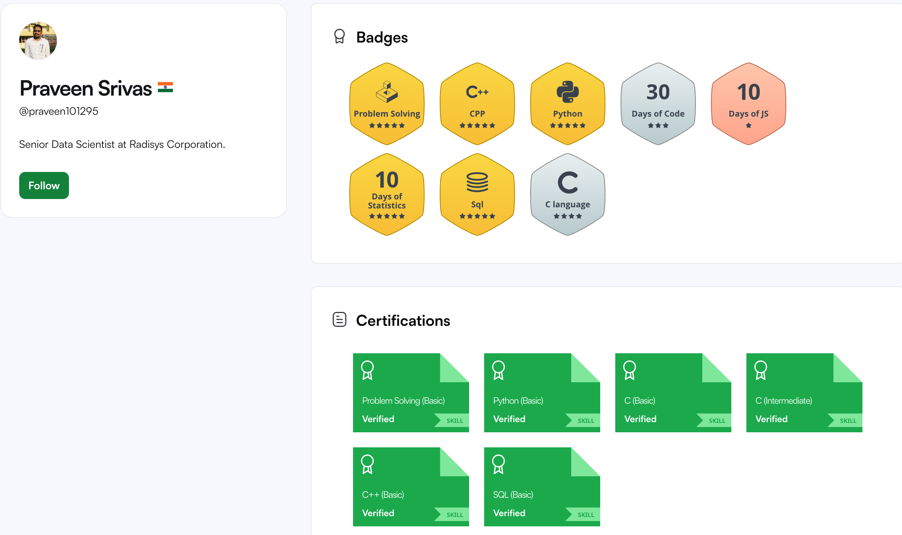
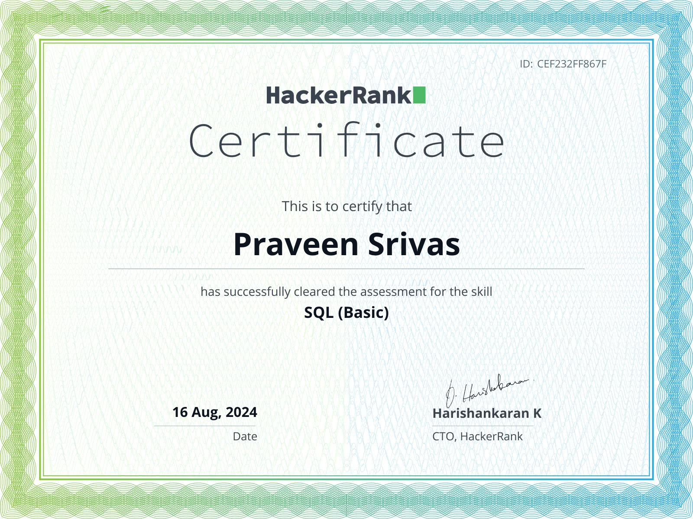

# 🧪 **Test Your SQL Skills on Different Platforms**

> **"The only way to learn a new programming language is by writing programs in it."**  
> — **Dennis Ritchie**

### 🌟 After embarking on this incredible SQL journey, it's time to put your skills to the test! Dive into these platforms and experience the real flavor of SQL in action.
***(Hoping that you have gone through all our tutorial,blogs of this repository)***

**Here are some great practice platforms to sharpen your SQL skills:**

- 🚀 [**HackerRank**](https://www.hackerrank.com/domains/sql?badge_type=sql) - Tackle challenges and earn badges.
- 🧠 [**stratascratch**](https://platform.stratascratch.com/coding?code_type=3&order_field=difficulty) - Practice with real-world datasets.
- 🎯 [**datalemur**](https://datalemur.com/sql-interview-questions) - Prepare for SQL interviews with top questions.

---

### ✨ **PS:** I'm also honing my SQL skills on these platforms! Check out my progress (updated on 16/August/2024):

- 🏆 **My HackerRank SQL Badge:click👉**
  

- 🎓 **SQL Practice Snapshot:**
  
  
**Many more to come,Happy coding and keep querying!** 🚀

---

### If you like this SQL series please leave a star ⭐ to the repository Happy Learning 

    <a href="https://www.linkedin.com/in/praveennitk/">
         LinkedIn
    </a> |
    <a href="https://github.com/praveenkumarsrivas">
         GitHub
    </a> |
    <a href="https://www.instagram.com/me_prvn/">
         Instagram
    </a>

